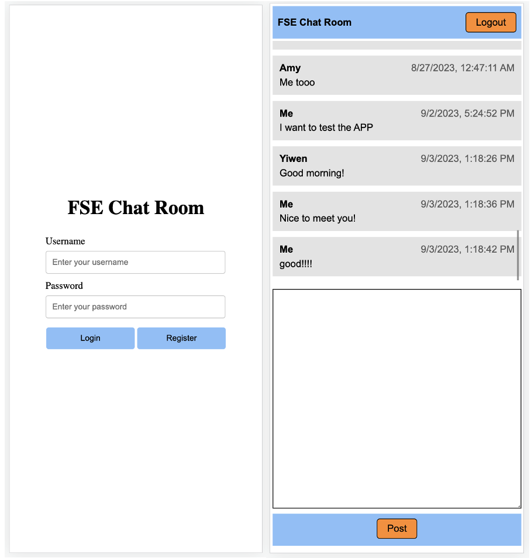
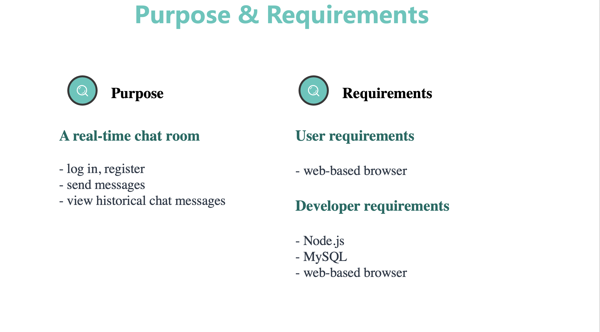
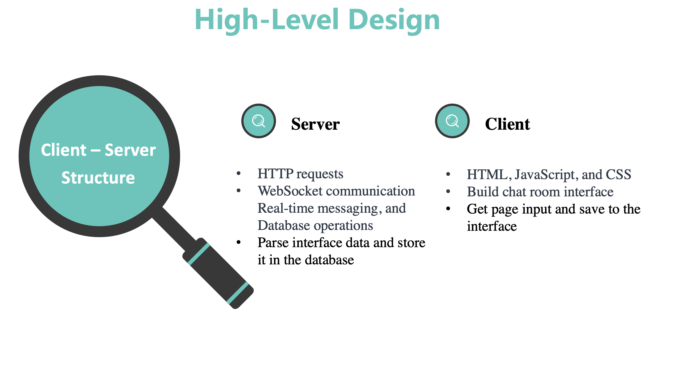
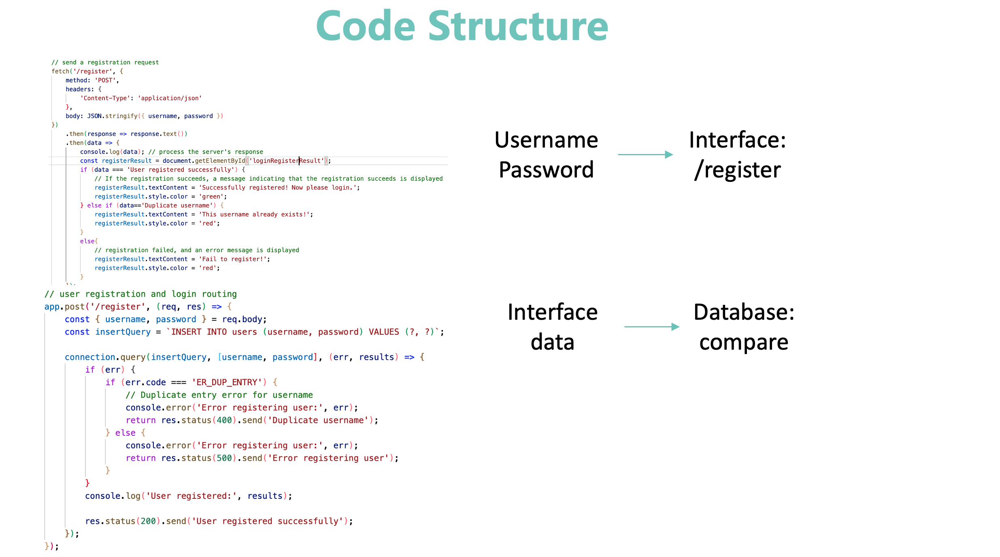
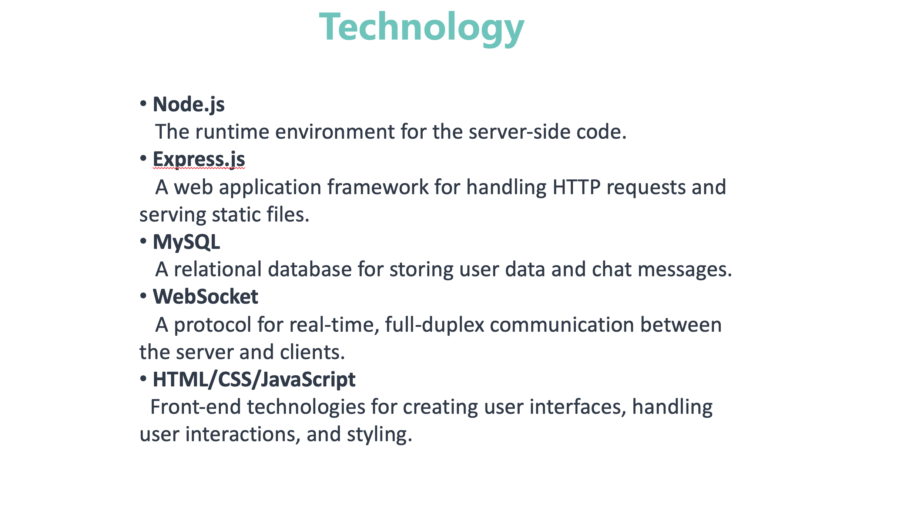

# Chat Room

## video

 https://youtu.be/ENuXKkKAQb8

## Function

- Register for the chat room with a new username (one that does not already exist) and password
- Enter the chat room (login) with his/her username and password
- See other users’ chat messages
- Post a chat message 
- Leave the chat room gracefully (logout) without simply closing the browser tab

